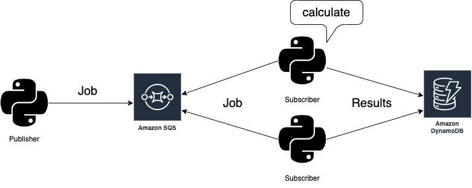

# SQS Samples with localstack

Sample implementation with job queue system.



## Usage

### Prepare

Add following profile to `~/.aws/config`

```sh
[profile localstack]
region = us-east-1
output = text
```

Setup dummy credentials.

```sh
$ aws configure
AWS Access Key ID [None]: dummy
AWS Secret Access Key [None]: dummy
Default region name [None]: us-east-1
Default output format [None]: text
```

Start localstack

```sh
$ git clone https://github.com/localstack/localstack.git
$ cd localstack
$ docker compose up -d
```

### Create SQS Queue

```sh
# Create normal queue.
$ aws sqs create-queue --queue-name test-queue --endpoint-url http://localhost:4566 --profile localstack
# Create dead letter queue.
$ aws sqs create-queue --queue-name test-dlq --endpoint-url http://localhost:4566 --profile localstack 

# Set dead letter queue arn as env
$ DLQ_NAME=`aws sqs get-queue-attributes --queue-url http://localhost:4566/000000000000/test-dlq --attribute-names QueueArn --endpoint-url http://localhost:4566 --output json --profile localstack | jq -r '.Attributes.QueueArn'`
$ echo "DLQ_NAME=$DLQ_NAME" >> publisher/.env
```

### Create DynamoDB Table

```sh
$ aws --endpoint-url http://localhost:4566 --profile localstack dynamodb \
    create-table \
    --table-name test-table \
    --attribute-definitions \
        AttributeName=jobID,AttributeType=S \
    --key-schema AttributeName=jobID,KeyType=HASH \
    --billing-mode PAY_PER_REQUEST
```

### Start 

Start one publisher and some subscribers on individual shells.

**publisher**

```sh
$ cd publisher
$ python3 main.py
```

**subscriber**

```sh
$ cd subscriber
$ python3 main.py
```

### Check DynamoDB

```sh
$ aws --endpoint-url http://localhost:4566 --profile localstack dynamodb scan --table-name test-table
```

### Check DLQ

```sh
$ aws sqs receive-message --queue-url http://localhost:4566/000000000000/test-dlq --endpoint-url http://localhost:4566 --profile localstack
```
